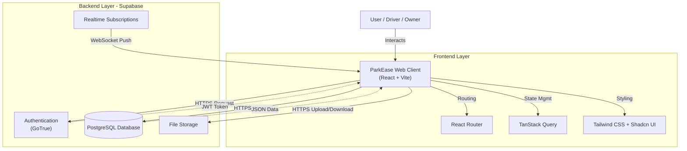
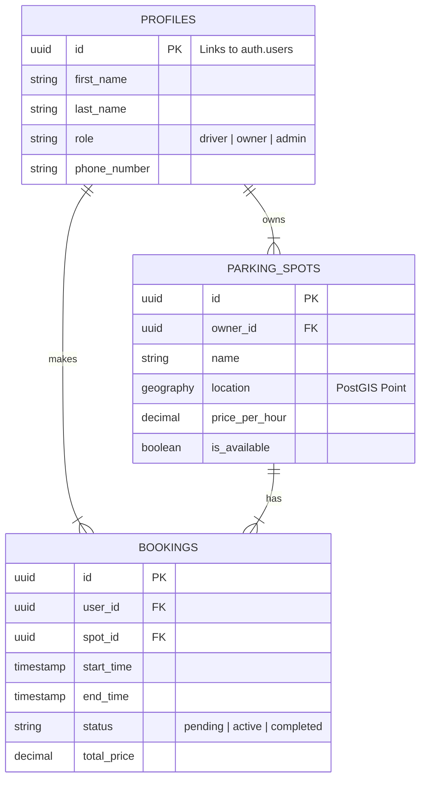

# ParkEase System Design

**Created by Bhagya**

This document outlines the comprehensive architecture, system design, and database structure of the ParkEase Web application.

## 1. High-Level Architecture

ParkEase is built on a robust **Client-Server** architecture, utilizing **Supabase** as a fully managed backend platform. This serverless approach ensures scalability and reduces maintenance overhead.

### Key Components

#### Client Side (Frontend)
- **Framework**: React 18 with TypeScript for type-safe, component-based UI.
- **Build Tool**: Vite for lightning-fast development and optimized production builds.
- **Styling**: Tailwind CSS with Shadcn UI for a modern, accessible, and responsive design.
- **State Management**: TanStack Query (React Query) for server state management, caching, and optimistic updates.
- **Routing**: React Router v6 for client-side navigation.
- **Maps**: Leaflet (via React-Leaflet) for interactive parking spot location and discovery.

#### Server Side (Backend - Supabase)
- **Authentication (GoTrue)**: Manages users, sessions, and secure access using JWTs. Supports Email/Password and OAuth.
- **Database (PostgreSQL)**: A powerful relational database storing all application data.
    - **PostGIS**: Extension enabled for geospatial queries (finding spots within "X" km).
- **Realtime**: Listens to database changes (inserts/updates) and pushes updates to the client via WebSockets (e.g., instant booking status updates).
- **Storage**: Secure object storage for uploading and serving parking spot images and user avatars.
- **Edge Functions**: (Optional) For custom server-side logic like payment processing.

## 2. Architecture Diagram

The following diagram illustrates the data flow and interaction between the User, Client, and Backend services.

## 3. Database Schema (ER Diagram)

The database involves strictly typed relationships to ensure data integrity. Below is the Entity-Relationship diagram.

## 4. Detailed Data Flows

### A. Authentication & Authorization
1. **Sign Up/In**: User submits credentials. Supabase Auth validates them and returns a session containing a **JWT Access Token**.
2. **Request Security**: Every subsequent API request (Database, Storage) includes this JWT in the `Authorization` header.
3. **Row Level Security (RLS)**: The PostgreSQL database inspects the JWT to determine if the user is allowed to access specific rows (e.g., "Users can only edit their *own* profile").

### B. Parking Search (Geospatial)
1. User enters a location or allows GPS access.
2. Frontend sends an RPC (Remote Procedure Call) to a PostgreSQL function `get_nearby_spots(lat, long, radius)`.
3. The database uses the **PostGIS** index to efficiently find spots within the radius and returns them strictly typed.

### C. Booking & Realtime Updates
1. **Creation**: Driver confirms booking -> `INSERT` into `bookings` table.
2. **Notification**:
    - Supabase Realtime detects the `INSERT`.
    - It broadcasts a payload `{ new: { id: ..., status: 'pending' } }` to the specific Parking Owner subscribed to that channel.
    - The Owner's dashboard updates immediately.

### D. QR Code Check-in System
1. **Generation**: The App generates a unique QR code string: `parkease:checkin:{booking_id}`.
2. **Scanning**: The Owner scans this code. The App extracts the `booking_id`.
3. **Validation**:
    - Query DB: `SELECT * FROM bookings WHERE id = booking_id`.
    - Logic: Check if `booking.status == 'pending'` and `booking.spot_id` belongs to this owner.
4. **Action**: `UPDATE bookings SET status = 'active'`.

## 5. Security Measures

- **RLS Policies**: The primary defense. No database access is allowed without an explicit policy (e.g., `create policy "Public read spots" on parking_spots for select using (true)`).
- **Input Validation**: Zod schemas validate all form inputs on the client side before sending.
- **SQL Injection Protection**: Supabase client uses parameterized queries, neutralizing injection attacks.
- **XSS Protection**: React automatically escapes content rendered in JSX.
